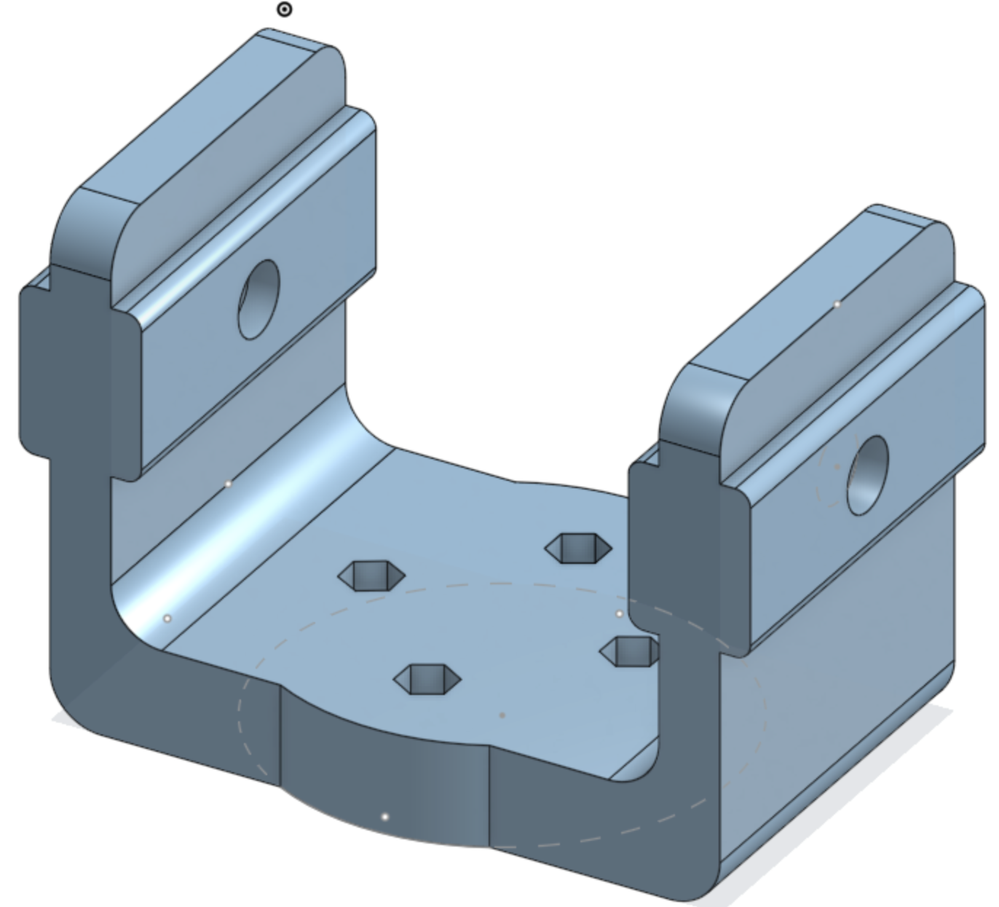

# Robot Joint 3D Printing Guide

## 🧩 Overview
This is an enhanced mechanical joint for a 6-DOF robotic arm, designed to be 3D printed for durability and structural strength. It includes mounting holes and structural reinforcement for real-world load handling.

---

## 🧪 Material Selection

## 🚀 **Nylon (PA) - PREMIUM CHOICE BECAUSE:**

#### 🌟 It Has Superior Advantages for Robot Joint:

##### Exceptional Mechanical Properties:
- **Tensile Strength**: 70-85 MPa (stronger than PETG and ABS)
- **Flexural Modulus**: 2,500-3,000 MPa (excellent stiffness)
- **Impact Resistance**: Outstanding toughness, won't crack under shock
- **Fatigue Resistance**: Exceptional for continuous high-cycle operation
- **Abrasion Resistance**: Self-lubricating properties reduce wear
- **Chemical Exposure**: Excellent resistance to lubricants

  
##### Advanced Operating Characteristics:
- **Heat Resistance**: Up to 100-120°C (handles hot motors well)
- **Chemical Resistance**: Excellent against oils, greases, and solvents
- **Low Friction**: Natural self-lubricating properties
- **Dimensional Stability**: Good accuracy when printed correctly
- **Durability**: Industrial-grade longevity

---

## ⚙️ Optimal Print Settings

### 🖨️ Quality Settings

| Parameter | Value | Reason |
|-----------|-------|---------|
| **Layer Height** | 0.2-0.25mm | Good balance of strength and detail |
| **Line Width** | 0.4 mm | Optimal for nylon flow characteristics |

### 🏗️ Strength Settings

| Parameter | Value | Reason |
|-----------|-------|---------|
| **Infill Density** | 50-60% | Nylon's strength allows lower infill |
| **Infill Pattern** | Gyroid/Grid | Excellent for nylon's properties |
| **Wall Line Count** | 3-4 walls | 1.2-1.6mm thickness for strength |
| **Top Layers** | 5 layers | Strong surface finish |
| **Bottom Layers** | 4 layers | Solid foundation |

### 🔧 support Settings (Nylon)
| Parameter | Value |
|-----------|-------|
| **generate support material** | ✅ | 

---

